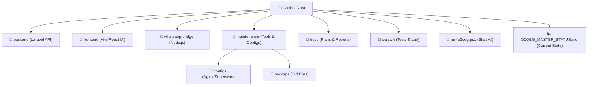

# 🗺️ O2OEG Project Master Map
**Status:** Organized & Controlled
**Date:** 2026-05-15

## 🏗️ Project Structure Overview

## 🛠️ Key Directories
- **`backend/`**: Contains the logic, database migrations, and API routes.
- **`frontend/`**: Contains the premium UI and dashboard components.
- **`whatsapp-bridge/`**: The engine connecting the platform to WhatsApp.
- **`maintenance/`**: Your toolbox for syncing to live server and managing configs.
- **`docs/`**: All the strategic plans, security reports, and project history.
- **`scratch/`**: A safe place for temporary experiments and testing.

## 🔑 Essential Commands
1. **To Start Everything:** Run `run-o2oeg.ps1` (It will check your database too!).
2. **To Check Status:** Read `O2OEG_MASTER_STATUS.md`.
3. **To Manage Live Server:** Use scripts inside `maintenance/`.

---
**This map ensures you never lose control of your project's architecture again.**
