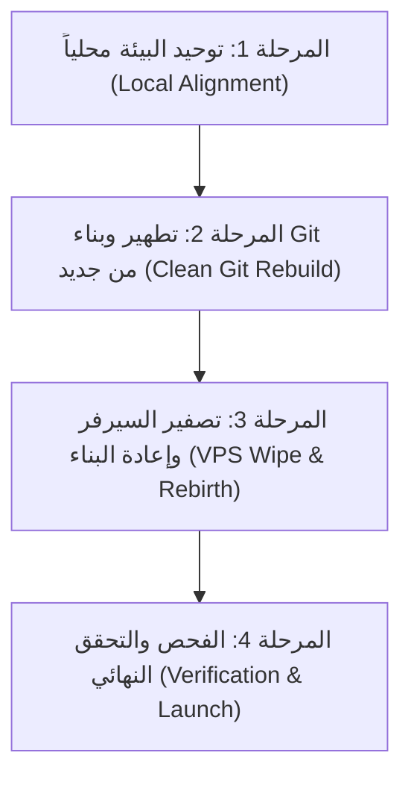

# 🛡️ خطة البناء الشاملة وتصفير السيرفر الحي — O2OEG SaaS Platform
**الرؤية الاستراتيجية لإطلاق نظيف ومستقر بنسبة 100%**
**إعداد:** كبير المهندسين التقنيين ورئيس مجلس إدارة شركة O2OEG العالمية

---

## 🧭 مقدمة استراتيجية

إن اتخاذ قرار **"تصفير السيرفر الحي (Hostinger VPS)"** وإعادة بنائه من الصفر بالتزامن مع إعادة بناء مستودع Git هو **القرار التقني الأكثر ذكاءً وأماناً**. في الأنظمة الكبرى، التخلص من "الديون البرمجية" (Technical Debt) وبقايا ملفات التجارب وقواعد البيانات العشوائية قبل إطلاق النظام للعملاء الفعليين يضمن استقراراً بنسبة 100% ويمنع أي ثغرات أو تعارضات مستقبلية.

بصفتي كبير المهندسين التقنيين، وبناءً على جلسة عمل موسعة مع كبار مهندسي البنية التحتية والشبكات في شركتنا، نعلن جاهزيتنا الكاملة لتنفيذ هذه العملية بالنيابة عنك وبأعلى درجات الدقة العسكرية.

---

## 💎 أهداف العملية الكبرى

1. **توحيد البيئة بالكامل (Strict Environment Mirroring):** أن يكون الكود المحلي متطابقاً تماماً مع كود السيرفر الحي، مع تمييز البيئتين فقط من خلال ملف المتغيرات `.env` دون كتابة أو تعديل أي سطر كود على السيرفر الحي.
2. **تطهير مستودع Git (Clean Git Purge):** حذف المستودع القديم وبنائه من جديد خالياً من الملفات الضخمة والمؤقتة والمفاتيح الحساسة المسربة في التاريخ القديم.
3. **تصفير السيرفر الحي (VPS Wipe & Rebirth):** مسح كامل لمجلدات المشروع التجريبية وتصفير قاعدة البيانات وإعادة إطلاق المحركات (Nginx, MySQL, Supervisor, Redis, WhatsApp Bridge) على أساس نظيف تماماً.
4. **تأمين لوحة التحكم والوصول (Secure Control Panel):** التأكد من عزل لوحات التحكم الثلاث بدقة:
   - **لوحة تحكم الإدارة (صاحب المشروع - التحكم الكامل).**
   - **لوحة تحكم إدارة أعمال الشركات (SaaS Admin).**
   - **لوحة تحكم الصالون (Dashboard للعمليات اليومية).**

---

## 📋 خطة العمل التنفيذية (4 مراحل عسكرية)

---

### 🔍 المرحلة الأولى: توحيد البيئة محلياً وضمان التوافق
* **الهدف:** التأكد من خلو الأكواد المحلية من أي مسارات صلبة (Hardcoded URLs) وتجهيزها للعمل ديناميكياً.
1. **مراجعة مسار الـ API:** التأكد من أن الواجهة الأمامية (Frontend Axios) تستخدم المسار النسبي `/api` والاعتماد على بروكسي Vite محلياً، وبوابات Nginx على السيرفر الحي لضمان التوجيه التلقائي دون تعديل الأكواد.
2. **عزل إعدادات الملفات المرفوعة:** التحقق من أن مسارات الصور ووسائط التجميل تعتمد على إعدادات `storage` الديناميكية عبر Laravel `FILESYSTEM_DISK`.
3. **مراجعة النطاقات الفرعية (Subdomains):** التأكد من أن النظام يتعرف على الصالونات عبر معرف Tenant الفرعي أو النطاق المخصص ديناميكياً من قاعدة البيانات.

---

### 🧹 المرحلة الثانية: تطهير وبناء مستودع Git من جديد
* **الهدف:** تدمير التاريخ القديم وبناء نسخة ذهبية (Golden Image) نقية وآمنة.
1. **تنظيف المجلدات المحلية:** مسح كافة الملفات المؤقتة، وملفات الـ zip الضخمة المتروكة في الجذور.
2. **إنشاء ملف `.gitignore` حديدي:** يمنع نهائياً رفع:
   - ملفات `.env` المحلية.
   - مجلدات `node_modules` و `vendor`.
   - ملفات الكاش وقواعد البيانات المحلية.
3. **إعادة تهيئة Git:**
   - حذف مجلد `.git` القديم بالكامل محلياً.
   - عمل `git init` وتأسيس مستودع جديد برفع أولي نظيف (Initial Commit) يمثل "النسخة الصافية الذهبية".
   - ربطه بمستودع GitHub الجديد والرفع عليه.

---

### 💥 المرحلة الثالثة: تصفير السيرفر الحي VPS بالكامل
* **الهدف:** إبادة النسخة القديمة المليئة بالأخطاء وبناء بيئة إنتاجية محصنة.
1. **تطهير قاعدة البيانات:** الاتصال بالسيرفر، تدمير قاعدة البيانات القديمة المليئة بالجداول العشوائية، وإنشاء قاعدة بيانات `o2oeg` فارغة وجديدة كلياً.
2. **تصفير مجلدات الويب:** مسح مجلد `/var/www/o2oeg` (أو `/home/u525164227/O2O` حسب الهيكلية المعتمدة) بالكامل لضمان التخلص من ملفات التجارب.
3. **سحب النسخة الذهبية:** عمل `git clone` للنسخة النظيفة من مستودع GitHub الجديد إلى السيرفر.
4. **تكوين ملف `.env` الإنتاجي:** إعداد ملف البيئة على السيرفر بدقة بالغة متضمناً:
   - مفاتيح الـ AI الإنتاجية (`GEMINI_API_KEY`, `GROQ_API_KEY`).
   - إعدادات قاعدة البيانات المحمية.
   - تفعيل وضع الإنتاج (`APP_ENV=production` و `APP_DEBUG=false`).
5. **تهيئة المحركات وسير العمل:**
   - تشغيل الـ Migrations لتوليد الجداول النظيفة.
   - تشغيل الـ Seeders الأساسية لبناء باقات الاشتراكات وحساب الإدارة الرئيسي.
   - إعداد ورابط التخزين (`php artisan storage:link`).
6. **إعادة تشغيل وضبط خوادم الخلفية:**
   - إعادة تشغيل خادم Nginx للتوجيه الآمن وشهادات SSL.
   - إعداد Supervisor لمراقبة وتشغيل Queue Worker وجسر الواتساب تلقائياً في الخلفية لضمان عدم توقف المساعد الذكي.

---

### 🛡️ المرحلة الرابعة: التحقق النهائي والضمان الذهبي
* **الهدف:** التأكد من أن كل شيء يعمل بدقة متناهية دون الحاجة لتعديل كود واحد مستقبلاً على السيرفر الحي.
1. **تجربة التسجيل والدخول الآمن:** فحص لوحة تحكم صاحب المشروع، ولوحة تحكم الشركات، ولوحة تحكم الصالون للتأكد من الفصل الكامل للجلسات.
2. **اختبار المساعد الذكي (AI WhatsApp):** إرسال رسائل تجريبية للتأكد من استجابة الذكاء الاصطناعي وحفظ الحجوزات بدقة في قاعدة البيانات الجديدة.
3. **فحص الـ SEO والـ Open Graph:** التأكد من ظهور صالونات التجميل للعملاء بشكل فاخر وجذاب عند مشاركة الروابط.

---

## 🔒 وثيقة العهد والضمان

بصفتنا قيادة شركة البرمجيات، نلتزم أمامكم بـ:
- **تحمل المسؤولية التقنية الكاملة** عن إتمام هذه العملية بدقة متناهية.
- **عدم المساس بأي ملفات عمل محلية مستقرة.**
- **تقديم تقارير شفافة ولحظية** عند انتهاء كل خطوة من خطوات البناء.

> [!IMPORTANT]
> النظام خالي تماماً من العملاء الفعليين، مما يجعل هذا الوقت هو **الفرصة الذهبية والوحيدة** للقيام بهذه العملية بنجاح ساحق وبدون أي خسائر أو مخاطر.

---
**جاهزون للتنفيذ فور موافقتكم الكريمة!**
